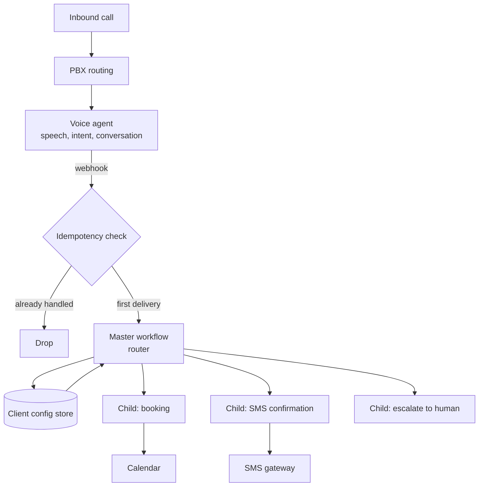

# voice-agent-orchestration

Reference implementation of the architecture I used to run an AI phone
receptionist in production for a tax practice.

A caller dials the practice. A voice agent answers, handles the
question, books the appointment, and texts a confirmation before the
caller hangs up. Nobody on staff touches it.

This repo is the sanitized version of that system: the architecture, the
two pieces of logic that actually earned their keep, and the failure
modes that only showed up once real calls were hitting it. Client
configuration, credentials and practice-specific business logic are not
included and never were in version control.

## How a call moves through it



## Master/child, and why

The obvious build is one workflow per client. It works, and it stops
working at about the third client, because every fix has to be applied
by hand in three places and they drift.

Instead there is one master workflow that owns routing, and small child
workflows that each do one thing. Client-specific values live in a
config store keyed by the inbound number, so onboarding a client is a
row, not a deployment. A bug fix lands once.

The tradeoff is real: the master workflow becomes a single point of
failure, and its routing logic needs to stay boring. That is a trade I
would make again, but it is a trade.

## What is in `src/`

Two modules. Both exist because of a specific production incident, and
both are the fix rather than the workaround.

### `webhook_dedupe.py`

Voice and telephony providers retry webhooks. They have to: the provider
cannot distinguish "your endpoint is down" from "your endpoint is slow".
If the handler is not idempotent, one phone call produces two bookings
and two confirmation texts, which is exactly what happened.

The fix derives a stable key from the parts of the payload that identify
the event, ignoring the metadata that changes between retries, and does
a single atomic check-and-set. Checking first and writing afterwards
leaves a window where two concurrent retries both pass, which is the
version I wrote first.

`tests/test_webhook_dedupe.py` includes a 24-thread race that asserts
exactly one delivery survives.

### `sms_payload.py`

The SMS gateway speaks XML. The first version built the document with
string formatting, which was fine until a caller mentioned a business
with an ampersand in its name. The gateway answered `200` with an error
in the body, so nothing appeared broken until someone noticed the
confirmations had stopped.

Two things came out of that. XML gets built by a serializer, never by
concatenation. And a `200` is not a success: the response body carries
the real status, so that is what gets parsed.

## Running it

```bash
pip install -r requirements.txt
pytest
```

27 tests, no network, no credentials.

## What this repo is not

It is not the client's production code, and it is not a drop-in product.
It is the part worth keeping: the shape of the system, and the two
places where the naive implementation quietly breaks.

See [docs/failure-modes.md](docs/failure-modes.md) for the rest of what
went wrong, including the call-routing misconfiguration that was
upstream of everything here and took the longest to find.
